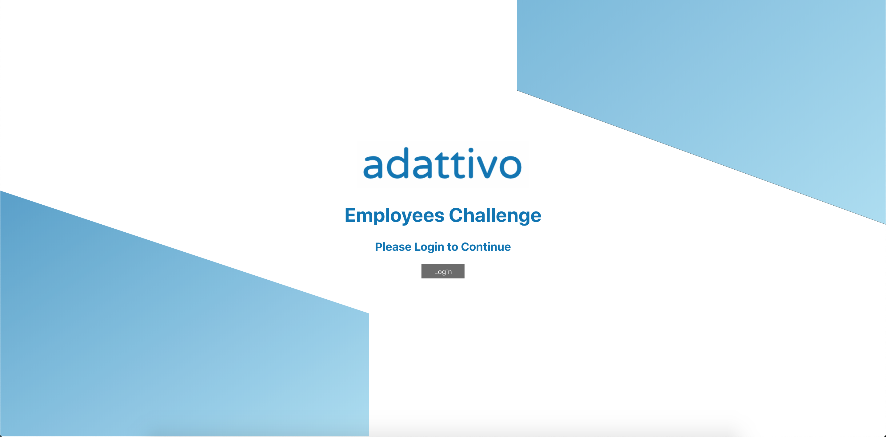
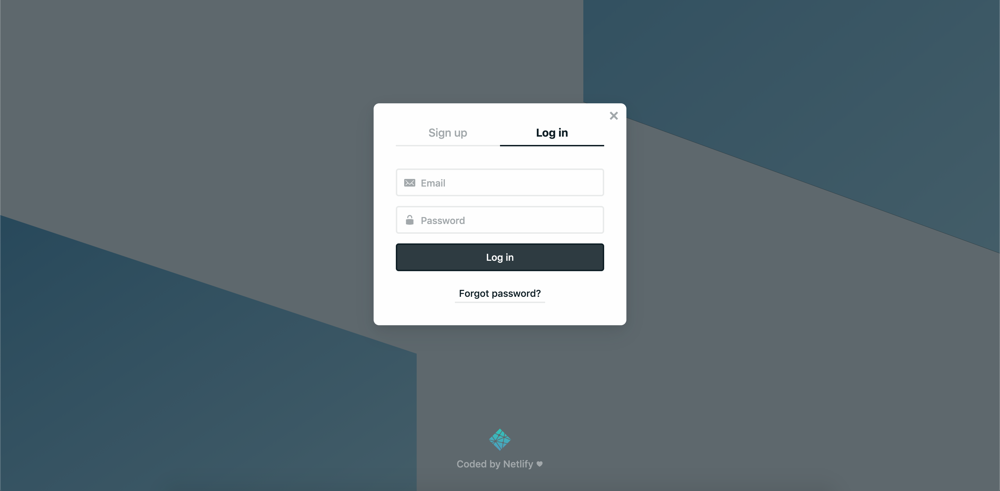
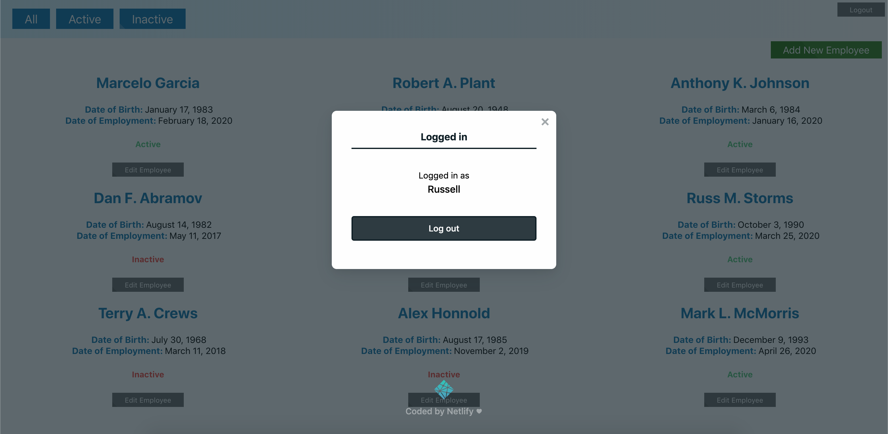
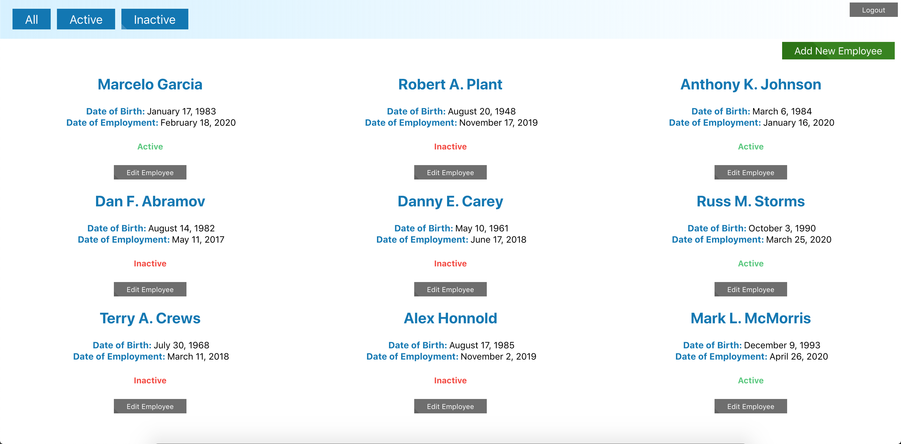
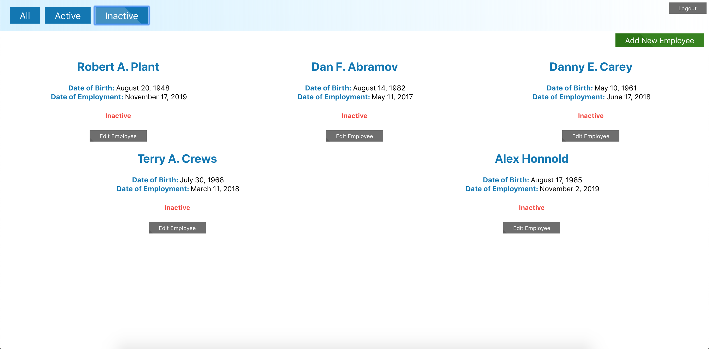
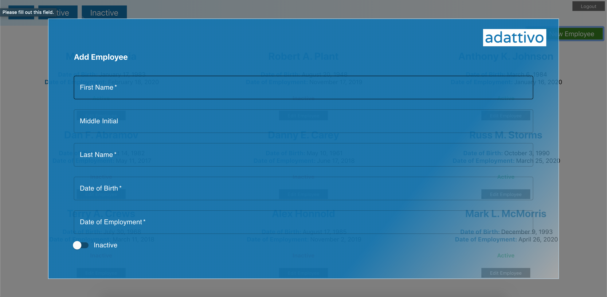
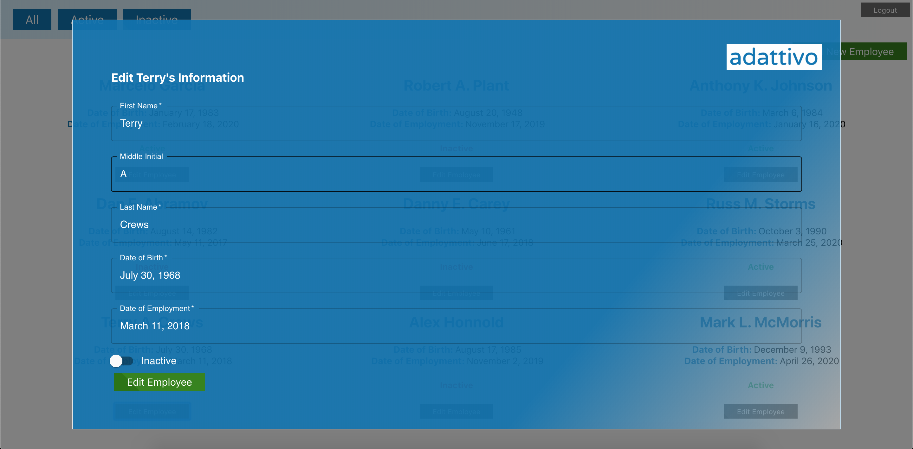

# Adattivo Employees Challenge

## What is it?

This application is an employee management system designed to:

* List all employees
* Add new employee
* Update settings of employee
* Deactivate an employee
* Show employee details
* Should also have to login first to the application to do any of the above actions
* Data should be stored in Redux state with default data in place for first run

## To view the deployed (deployed with Netlify) site, visit:

[https://adattivoemployeeschallenge.netlify.com/](https://adattivoemployeeschallenge.netlify.com/)

## To run locally, clone repo and run:
### `npm install`

#### then

### `yarn start`

This runs the app in the development mode. 
Open [http://localhost:3000](http://localhost:3000) to view it in the browser.

The page will reload if you make edits. 
You will also see any lint errors in the console.

## Login & Validation

## Employee Management

## Filter by Status

## Add Employee

## Edit Employee Information

